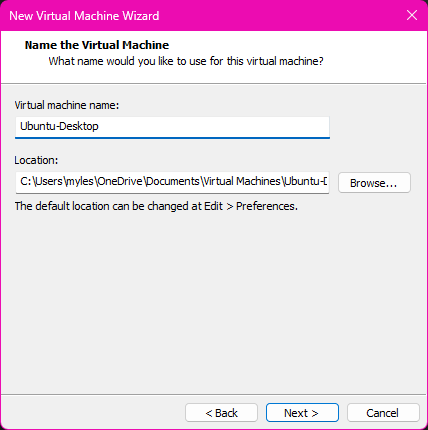

# Setting up Ubuntu VM

1. Download the .iso file from ubuntu.com/download

  

2. In the VMWare workstation home screen, select "Create a New Virtual Machine"

  

3. In the New Virtual Machine Wizard(NVMW), hit `Next >`
 
  
  
4. import the .iso file downloaded in Step 1, then hit `Next >`
 
  

5. Enter full name, User Name, and Password, then hit `Next >`  

  

6. Create a hostname for your VM then hit `Next >` 
 
   

7. Select `Next >` then `Finish` on the next 2 pages in the NVMW 

  
  
